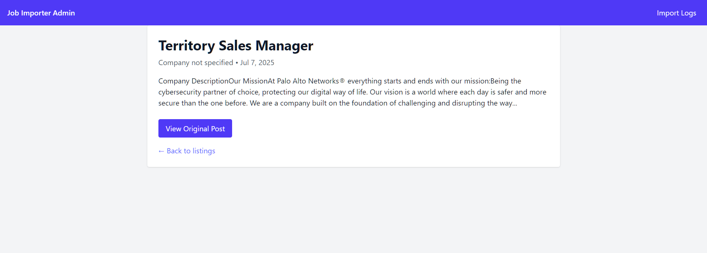
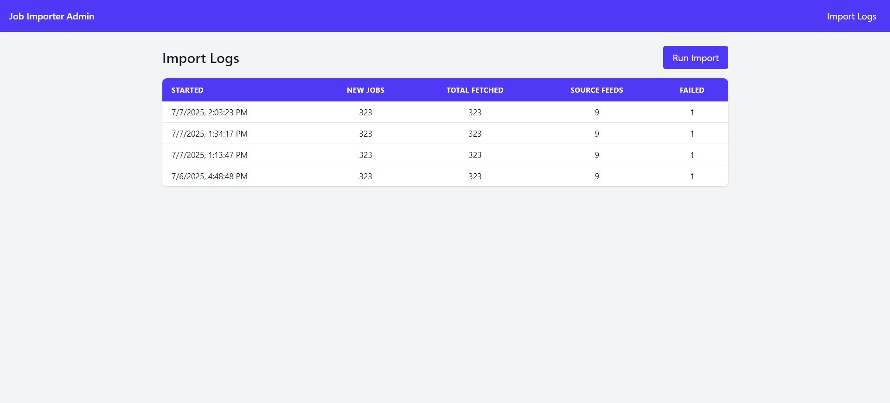
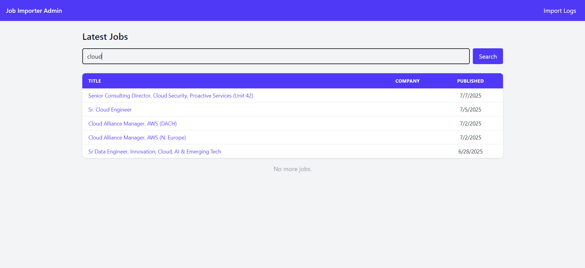

# Scalable Job Importer

A demo‑ready MERN‑stack project that polls multiple job‑board RSS feeds, queues each entry in Redis via **BullMQ**, stores normalised jobs in **MongoDB**, and ships a **React 18 + Tailwind CSS** admin panel for search, job detail, and import‑history tracking.

---

## ✨ Features

| Feature                 | Notes                                              |
| ----------------------- | -------------------------------------------------- |
| **Hourly feed polling** | 9 Jobicy feeds + HigherEdJobs (configurable)       |
| **Queue & worker**      | BullMQ v5, concurrency & rate‑limit via env vars   |
| **MongoDB models**      | `rawFeedItems`, `jobs`, `importLogs`               |
| **Admin UI**            | Jobs list w/ search & _Load More_, job detail view |
| **Import logs**         | History table + **Run Import** button              |

---

## 🛠 Tech Stack

| Layer         | Tech                               |
| ------------- | ---------------------------------- |
| **Backend**   | Node.js 20 · Express · TypeScript  |
| **Queue**     | Redis 7 · BullMQ                   |
| **Database**  | MongoDB 7 (Mongoose 8)             |
| **Frontend**  | React 18 (Vite 7) · Tailwind CSS 4 |
| **Dev Tools** | Nodemon · ESLint · Docker Compose  |

---

## 🖼️ Screenshots

### 🔍 Job Listing Page


### 📄 Job Details



### 📋 Import Logs



### 🔎 Search in Action



---

## 🚀 Quick Start

```bash
# 1 · Clone & install
 git clone https://github.com/<your‑user>/job-importer.git
 cd job-importer
 npm install                  # installs root, client & server packages

# 2 · Copy env & fill creds
 cp server/.env.example server/.env

# 3 · (Optional) spin up Mongo + Redis via Docker
 docker compose up -d        # uses ./docker-compose.yml
   # ‑ Mongo @ mongodb://localhost:27017
   # ‑ Redis @ redis://localhost:6379

# 4 · Dev mode
 npm run dev                 # ROOT script, uses **concurrently** to launch:
                             #   • server (http://localhost:5000)
                             #   • client (http://localhost:5173)
```

> **Tip:** `npm run dev` is the only command you need in development – it starts both Express API **and** Vite React app at once.

---

## 🔐 Environment Variables

`server/.env.example` → copy to `.env`

```env
PORT=5000
# Local default – Mongo container will create this DB automatically
MONGO_URI=mongodb://localhost:27017/job_importer

# Redis container credentials
REDIS_HOST=127.0.0.1
REDIS_PORT=6379

# Queue tuning
QUEUE_CONCURRENCY=5
```

> **First‑time Mongo setup:** No manual collection creation is required.\
> The first `POST /imports/run` seeds `rawFeedItems`, `jobs`, and `importLogs` automatically.

---

## 📦 Docker Compose

A ready‑made `` lives in the project root. It spins up a local **MongoDB 7** instance and a **Redis 7‑alpine** container, each mapped to default ports:

```bash
# start databases in the background
docker compose up -d

# stop and remove the containers
docker compose down -v
```

Once the services are up, `npm run dev` will connect automatically using the URIs in your `.env`.yaml author: lakshya version: '3.9' services: mongo: image: mongo:7 ports: - 27017:27017 volumes: - mongo-data:/data/db

redis: image: redis:7-alpine ports: - 6379:6379

volumes: mongo-data:

```

Run `docker compose up -d` and both databases are ready for the app.

---

## 📑 API Reference

| Method | Endpoint        | Description                              |
| ------ | --------------- | ---------------------------------------- |
| GET    | `/jobs`         | Query jobs `?q=designer&skip=0&limit=20` |
| GET    | `/jobs/:guid`   | Single job detail                        |
| POST   | `/imports/run`  | Trigger feed fetch + queue push          |
| GET    | `/imports/logs` | Import history (paged)                   |

---

## Future Roadmap

- Live queue status via Socket.IO / SSE
- Exponential retry & dead‑letter queue
- Micro‑service split (fetcher vs processor)
- CI/CD with GitHub Actions
- Cloud deploy: Mongo Atlas + Upstash Redis + Render/Vercel

---

## License

MIT

```
